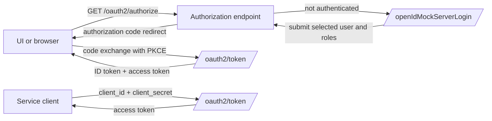

# Architecture

`jeap-oauth-mock-server` is a reusable OAuth2 / OpenID Connect authorization server for development and testing. It is
built on Spring Security Authorization Server and issues signed JWTs with configurable claims for jEAP-style
authorization scenarios.

It supports two main flows:

- `authorization_code` for UI logins via the custom login form
- `client_credentials` for service-to-service access tokens

## Security note

This server is a test double, not a real identity provider. It can impersonate any configured user and role set and
must never be deployed to production environments.

## Module structure

```text
jeap-oauth-mock-server/           # Library module with the server implementation
jeap-oauth-mock-server-instance/  # POM parent for downstream mock-server instances
```

- `jeap-oauth-mock-server` contains the Spring Boot application, configuration properties, login form, token
  customizers, and patched Spring Authorization Server classes.
- `jeap-oauth-mock-server-instance` is a `pom`-packaged parent that already depends on the library and disables some
  parent plugin executions that are inconvenient for instance projects.

## Main building blocks

- `config/` binds `oauth-mock-data.*` and `mockserver.base-url`.
- `security/` wires Spring Authorization Server, registered clients, login handling, token introspection, CORS, and
  issuer/JWK settings.
- `login/` provides the custom login form and forces a fresh login session for each auth-code round-trip.
- `token/` contains the default jEAP token mapping, optional eIAM-style mapping support, dynamic-scope handling, roles
  pruning, and the token-customizer extension point.

## Supported flows



The login form is only reachable through a saved authorization request in the session. `ForceLoginFormFilter` clears
that session again after the authorization response redirect so each new test starts from the form.

## Client and user model

Configured clients are converted into Spring `RegisteredClient` objects.
Depending on the configured properties, a client can support:

- `authorization_code`
- `client_credentials`
- both flows when no explicit `context` is configured and redirect URIs are present

Configured users are only needed for interactive `authorization_code` logins. Service-to-service tokens use client
configuration only.

## JWT signing keys and issuer

The server generates a fresh RSA key pair on every startup. The private key is used to sign JWTs; the public key is
published at `` `<base-url>`/.well-known/jwks.json ``.

The key pair is not persisted. After a restart or redeployment, previously issued tokens can no longer be validated
against the new JWK set.

The token issuer is taken from `mockserver.base-url`, and the JWK endpoint path is fixed to `/.well-known/jwks.json`
for backward compatibility.

## Patched upstream classes

The repository intentionally carries small patches against Spring Security Authorization Server classes:

- `InMemoryRegisteredClientRepository` allows non-unique client secrets across clients.
- `SecurityConfig.validateScopeSupportingDynamicScopes(...)` adds dynamic-scope validation for the authorization-code
  flow.
- `org.springframework.security.oauth2.server.authorization.authentication.OAuth2ClientCredentialsAuthenticationProvider`
  adds dynamic-scope validation for the client-credentials flow.

When upgrading Spring Security Authorization Server, review these patches. See [Upgrading](upgrading.md).

## Related topics

- [Getting started](getting-started.md)
- [Configuration](configuration.md)
- [Custom token claims](custom-token-claims.md)
- [Upgrading](upgrading.md)
